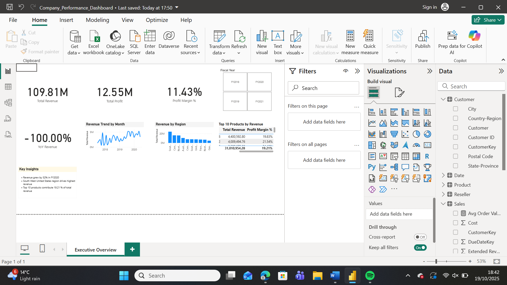
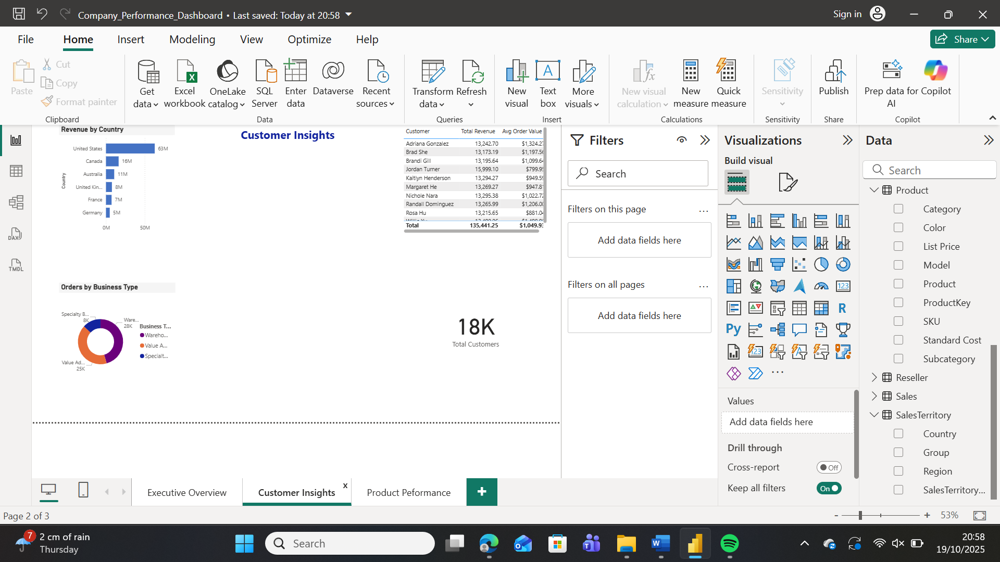
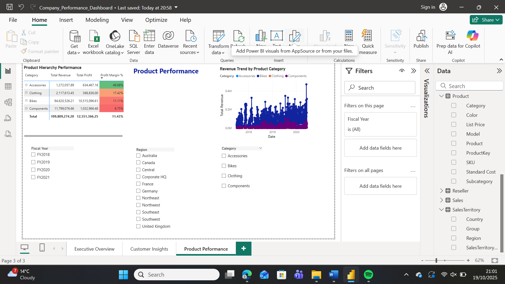
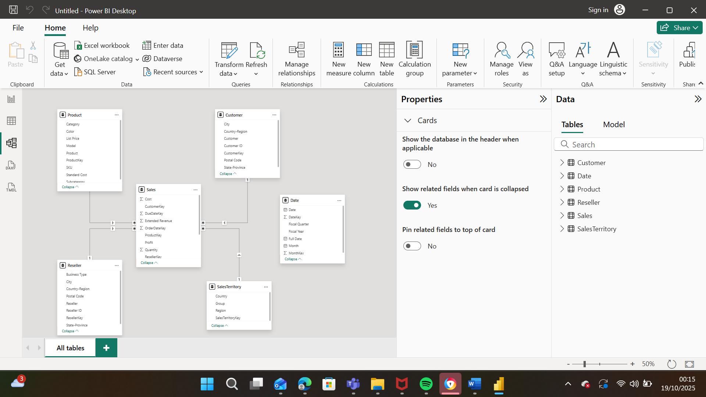

# Company Performance Dashboard

A professional Power BI dashboard delivering end-to-end analysis of company sales, customer, and product performance using the AdventureWorks dataset.
This project demonstrates skills in data modelling, DAX, Power Query, and data storytelling for business intelligence




---

## Project Structure
```
Company-Performance-Dashboard/
├── Data/
│   └── AdventureWorks Sales.xlsx          # Source data
├── Screenshots/
│   ├── executive_overview.png             # Page 1 - Executive Overview
│   ├── customer_insights.png              # Page 2 - Customer Insights
│   └── product_performance.png            # Page 3 - Product Performance
├── Company_Performance_Dashboard.pbix     # Power BI file
└── README.md                              # Project documentation

---

## Project Overview

This Power BI dashboard provides executive-level insights into company performance, focusing on:
- **Sales performance** (revenue, profit, margin trends)
- **Year-over-year growth** analysis
- **Customer behavior** and segmentation
- **Product performance** by category and region
- **Geographic analysis** across countries and regions

---

## Dashboard Pages

### 1️⃣ **Executive Overview**
High-level summary for leadership:
- **KPI Cards:** Total Revenue, Total Profit, Profit Margin %, YoY Revenue Growth
- **Line Chart:** Revenue by month
- **Bar Chart:** Revenue by country
- **Table:** Top 10 products by revenue
- **Slicer:** Fiscal Year filter


---

### 2️⃣ **Customer Insights**
Deep dive into customer behavior and demographics:
- **Bar Chart:** Revenue by country
- **Donut Chart:** Orders by business type
- **Table:** Top 10 customers by revenue
- **Metrics:** Average order value, customer distribution




---

### 3️⃣ **Product Performance**
Detailed product analysis with drill-down capabilities:
- **Matrix:** Product hierarchy (Category → Subcategory → Product) with conditional formatting
- **Line Chart:** Revenue trends by product category
- **Filter Panel:** Year, Region, and Category slicers
- **Conditional Formatting:** Profit margin % color-coded (red to green)



---

## 🛠️ Technical Implementation

### **Data Model**
- **Star schema** design
- **Fact Table:** Sales (60K+ transactions)
- **Dimension Tables:** Date, Customer, Product, Reseller, SalesTerritory
- **Relationships:** Many-to-one (*:1) between fact and dimensions

### **Data Transformations (Power Query)**
- Removed unused columns (ModifiedDate, RowGuid)
- Renamed columns for clarity (SalesAmount → Revenue, TotalProductCost → Cost)
- Added calculated column: `Profit = Revenue - Cost`
- Ensured proper data types (dates, numbers, text)
- Trimmed whitespace from text fields

### **DAX Measures**
```DAX
Total Revenue = SUM(Sales[Revenue])

Total Cost = SUM(Sales[Cost])

Total Profit = [Total Revenue] - [Total Cost]

Profit Margin % = DIVIDE([Total Profit], [Total Revenue])

Total Orders = COUNTROWS(Sales)

Avg Order Value = DIVIDE([Total Revenue], [Total Orders])

YoY Revenue = 
VAR CurrentFiscalYear = MAX('Date'[Fiscal Year])
VAR CurrentYearNum = VALUE(RIGHT(CurrentFiscalYear, 4))
VAR PreviousFiscalYear = "FY" & (CurrentYearNum - 1)
VAR CurrentRevenue = 
    CALCULATE([Total Revenue], 'Date'[Fiscal Year] = CurrentFiscalYear)
VAR PreviousRevenue = 
    CALCULATE([Total Revenue], 'Date'[Fiscal Year] = PreviousFiscalYear)
RETURN
IF(
    NOT(ISBLANK(PreviousRevenue)) && PreviousRevenue <> 0,
    DIVIDE(CurrentRevenue - PreviousRevenue, PreviousRevenue),
    BLANK()
)
```

---

## 📈 Key Insights

- **Revenue Growth:** 52.27% YoY growth in FY2020
- **Profit Margin:** Maintained at ~11-13% across all years
- **Top Products:** Bikes category drives 80%+ of revenue
- **Geographic Performance:** United States accounts for majority of sales, but Europe shows strong margin growth
- **Business Channel:** Value Added Resellers contribute highest order volume

---

##  How to Use

### **Prerequisites**
- [Power BI Desktop](https://powerbi.microsoft.com/desktop/) (free download)
- Windows 10 or 11

### **Steps**
1. **Clone or download** this repository
```bash
   git clone https://github.com/Samson-tech-code/company-performance-dashboard.git
```

2. **Open Power BI Desktop**

3. **Open the file:**
   - File → Open → Browse to `Company_Performance_Dashboard.pbix`

4. **Explore the dashboard:**
   - Navigate between pages using tabs at bottom
   - Use slicers to filter data
   - Drill down into matrix hierarchies
   - Hover over visuals for tooltips

5. **(Optional) Refresh data:**
   - Home → Refresh (if you update the Excel file)

---

## 📚 Data Source

**Dataset:** AdventureWorks Sales Sample
- **Source:** [Microsoft Power BI Samples](https://learn.microsoft.com/en-us/power-bi/create-reports/desktop-dimensional-model-report)
- **Tables:** Sales, Customer, Product, Reseller, Date, SalesTerritory
- **Time Period:** FY2018 - FY2020
- **Records:** 60,000+ sales transactions

---

## 🎨 Design Principles

- **Color Palette:** Professional blue/gray business palette
- **Typography:** Segoe UI, 10-16pt for readability
- **Layout:** Consistent spacing and alignment across all pages
- **Accessibility:** High contrast, clear labels, logical visual hierarchy
- **Interactivity:** Cross-filtering enabled between visuals

---

## 🔧 Tools & Technologies

| Tool | Purpose |
|------|---------|
| **Power BI Desktop** | Dashboard creation and visualization |
| **Power Query** | Data transformation and cleaning |
| **DAX** | Calculated measures and KPIs |
| **Excel** | Data storage & source integration |
| **Git/GitHub** | Version control and sharing |

---

## 📸 Screenshots

<details>
<summary>Click to expand all screenshots</summary>

### Executive Overview


### Customer Insights


### Product Performance


### Data Model


</details>

---

## 📝 Future Enhancements

- [ ] Integrate forecasting using Power BI AI visuals
- [ ] Create drill-through pages for detailed product analysis
- [ ] Add bookmarks for different executive views
- [ ] Implement custom tooltips with product images
- [ ] Publish to Power BI Service for web access

---

## 👤 Author

**Samson Olanrewaju**
- [GitHub: @Samson-tech-code](https://github.com/Samson-tech-code)
- LinkedIn: linkedin.com/in/samson-olanrewaju-40b545194

---

## 📄 License

This project is for educational purposes. The AdventureWorks dataset is provided by Microsoft under educational data license.

---

## 🙏 Acknowledgments

- Microsoft for the AdventureWorks sample dataset
- Power BI community for best practices and inspiration

---

**⭐ If you found this project helpful, please give it a star!**

